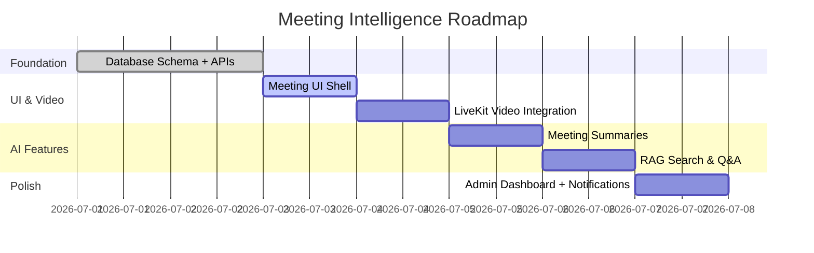

# Meeting Intelligence - Quick Start Guide 🚀

## Current Status: Day 2 Complete ✅

### What's Already Done
```
✅ Database schema with 9 meeting tables
✅ Gemini AI helper (summaries + embeddings)
✅ Meeting list & create API
✅ Status control API (start/join/leave/end)
✅ Chat messages API
✅ Document attachment API
✅ Environment variables documented
✅ Migration file created
```

### What's Missing (Days 3-7)
```
❌ Meeting UI in page.tsx
❌ LiveKit video integration
❌ AI summary generation endpoint
❌ RAG search & Q&A
❌ Admin live dashboard
❌ Lifecycle notifications
```

---

## Tech Stack: 100% Free ✨

| Technology | Purpose | Cost | Setup Time |
|------------|---------|------|------------|
| **Gemini API** | AI summaries, embeddings, Q&A | FREE | 2 min |
| **LiveKit Cloud** | Video meetings | FREE (10k min/month) | 5 min |
| **Vercel Blob** | File storage (optional) | FREE (1 GB) | 2 min |
| **Neon PostgreSQL** | Already using | FREE | Done ✅ |

---

## Timeline: 6-7 Days Total



---

## Next Steps (Day 3: Today!)

### 1. Apply Database Migration ⚠️
**Required before anything works on deployed app:**
```bash
npx prisma migrate deploy
```

### 2. Start UI Integration (6-8 hours)
Edit `src/app/page.tsx` to add:
- Meeting types (Meeting, MeetingMessage, etc.)
- Meeting state loading from `/api/meetings`
- "Meetings" navigation for Manager/Employee
- "Live Meetings" navigation for Admin
- MeetingListView component
- MeetingRoomView component with chat/docs/status

**See detailed steps in**: `MEETING_IMPLEMENTATION_ROADMAP.md` → Day 3

---

## Quick Demo Flow (When Complete)

### Manager Experience
```
1. Navigate to "Meetings"
2. Click "Schedule Meeting"
3. Select employees, add title/agenda
4. Start meeting → video room opens
5. Chat with team, share documents
6. End meeting → AI summary auto-generates
7. View summary with action items
8. Search past meetings with RAG
```

### Employee Experience
```
1. See "Meeting with [Manager]" scheduled
2. Click "Join Meeting"
3. Video/audio connects
4. Participate in chat
5. After meeting: view summary
6. See assigned action items
```

### Admin Experience
```
1. Open "Live Meetings" dashboard
2. See all meetings: scheduled/live/ended
3. View participant counts, durations
4. Click any meeting → read-only view
5. Search across all meetings
6. Monitor AI processing status
```

---

## Required API Keys (Get These Next)

### 1. Gemini API Key (Required for AI)
```bash
# Visit: https://aistudio.google.com/app/apikey
# Time: 2 minutes
# Add to Vercel environment:
GEMINI_API_KEY=your_key_here
GEMINI_MODEL=gemini-1.5-flash
```

**What it enables:**
- AI meeting summaries
- Discussion point extraction
- Action item detection
- Sentiment analysis
- RAG embeddings
- Meeting Q&A

### 2. LiveKit Credentials (Required for Video)
```bash
# Visit: https://cloud.livekit.io/
# Create project → Copy credentials
# Time: 5 minutes
# Add to Vercel environment:
LIVEKIT_API_KEY=APIfromLiveKit
LIVEKIT_API_SECRET=SECRETfromLiveKit
NEXT_PUBLIC_LIVEKIT_URL=wss://your-project.livekit.cloud
```

**What it enables:**
- Video/audio meetings
- Screen sharing
- Participant management
- Recording (optional)

### 3. Vercel Blob (Optional for File Uploads)
```bash
# In Vercel project: Storage → Create Blob Store
# Auto-injects: BLOB_READ_WRITE_TOKEN
# Set: MEETING_STORAGE_PROVIDER=vercel-blob
```

**What it enables:**
- Upload meeting documents (vs URL links)
- Store meeting recordings

---

## File Structure Reference

```
atomquest-portal/
├── prisma/
│   ├── schema.prisma                    ✅ Meeting models added
│   └── migrations/
│       └── 20260707000000_meeting_intelligence/
│           └── migration.sql            ✅ Created (not applied yet)
│
├── src/
│   ├── app/
│   │   ├── page.tsx                     ❌ Need to add meeting UI
│   │   └── api/
│   │       ├── meetings/
│   │       │   ├── route.ts             ✅ List & create
│   │       │   └── [meetingId]/
│   │       │       ├── status/route.ts  ✅ Start/join/leave/end
│   │       │       ├── messages/route.ts ✅ Chat
│   │       │       ├── documents/route.ts ✅ Attach docs
│   │       │       ├── livekit-token/   ❌ Day 4
│   │       │       ├── summary/         ❌ Day 5
│   │       │       └── embed/           ❌ Day 6
│   │       ├── query/                   ❌ Day 6 (RAG)
│   │       └── state/route.ts           ✅ Existing (don't touch)
│   │
│   └── lib/
│       ├── auth.ts                      ✅ Use getSessionUser()
│       ├── prisma.ts                    ✅ DB client
│       ├── gemini.ts                    ✅ AI helper
│       ├── rag.ts                       ❌ Day 6 (similarity search)
│       └── livekit.ts                   ❌ Day 4 (optional)
│
├── .env.example                         ✅ Meeting vars documented
├── MEETING_AI_IMPLEMENTATION_PLAN.md    ✅ Original detailed plan
├── MEETING_IMPLEMENTATION_ROADMAP.md    ✅ Complete roadmap
└── QUICK_START_MEETINGS.md              📍 You are here
```

---

## Dependencies to Install (Day 4)

When you reach LiveKit video integration:
```bash
npm install livekit-client @livekit/components-react livekit-server-sdk
```

That's it! Everything else is already installed.

---

## Testing Checklist (After Each Day)

### Day 3: UI Shell
- [ ] Can schedule a meeting as Manager
- [ ] Employees see assigned meetings
- [ ] Chat messages persist and reload
- [ ] Documents attach via URL
- [ ] Start/End meeting updates status

### Day 4: Video
- [ ] Video/audio connects
- [ ] Multiple participants see each other
- [ ] Screen sharing works
- [ ] Join/leave tracked in database

### Day 5: AI Summary
- [ ] Summary auto-generates after meeting ends
- [ ] Discussion points extracted
- [ ] Action items created
- [ ] Sentiment analysis shown

### Day 6: RAG
- [ ] Search "What blockers came up?" returns results
- [ ] Answer includes meeting citations
- [ ] Admin can search all meetings
- [ ] Participants can search own meetings

### Day 7: Dashboard
- [ ] Admin sees live meeting list
- [ ] Duration calculated for active meetings
- [ ] Notifications sent at key events
- [ ] Filters work (status, department, date)

---

## Cost Analysis (Real Usage)

### Free Tier Limits
```
Gemini API:      60 requests/min, 1M tokens/day
LiveKit Cloud:   10,000 participant-minutes/month
Vercel Blob:     1 GB storage
Neon:            0.5 GB database storage

Realistic Usage (50 users, 10 meetings/month):
- Meetings:      10 meetings × 30 min × 3 participants = 900 min/month
- AI Summaries:  10 summaries/month = ~50k tokens
- Storage:       ~100 MB meetings + docs

Result: 100% free, well within all limits ✅
```

---

## Common Issues & Fixes

### "Table 'Meeting' does not exist"
```bash
# Run migration first!
npx prisma migrate deploy
```

### "AI summary unavailable"
```bash
# Add Gemini API key to Vercel environment
# Verify at: https://aistudio.google.com/app/apikey
```

### "LiveKit connection failed"
```bash
# Check these 3 env vars in Vercel:
LIVEKIT_API_KEY
LIVEKIT_API_SECRET
NEXT_PUBLIC_LIVEKIT_URL  # Must start with wss://
```

### "No meetings showing up"
```bash
# Check in browser console:
# - API call succeeds? (Network tab → /api/meetings)
# - Session valid? (Should redirect to login if not)
# - Role correct? (Employees only see assigned meetings)
```

---

## Architecture Decisions

### Why separate meeting APIs (not /api/state)?
- Goals: Small, infrequent updates → batch save pattern works
- Meetings: Large, real-time events → need immediate persistence
- Separation prevents meeting events from blocking goal saves

### Why JSON embeddings (not pgvector)?
- Simpler initial implementation
- Works for demo scale (<1000 chunks)
- Easy migration path to pgvector later
- No provider lock-in

### Why LiveKit (not custom WebRTC)?
- Free tier generous
- Handles signaling/TURN/STUN
- Built-in recording
- React components ready
- Less code to maintain

### Why Gemini (not OpenAI)?
- **Free tier** (OpenAI requires payment)
- Good quality for summaries
- Embedding model included
- JSON mode support
- Rate limits acceptable

---

## Handoff Checklist

If switching to another LLM mid-implementation:

**Provide these files:**
1. `MEETING_IMPLEMENTATION_ROADMAP.md` (this file)
2. `QUICK_START_MEETINGS.md` (overview)
3. `MEETING_AI_IMPLEMENTATION_PLAN.md` (original plan)
4. `src/lib/gemini.ts` (AI integration reference)
5. `prisma/schema.prisma` (data model)

**State explicitly:**
- Current day completed (e.g., "Day 2 done, Day 3 in progress")
- What file you're editing (e.g., "Adding MeetingListView to page.tsx")
- What API keys you've added to Vercel
- Any blockers or errors encountered

**Example handoff message:**
> "I completed Day 3 (meeting UI shell). Managers can schedule meetings, employees can join, chat works. Starting Day 4 (LiveKit video). Need to create `/api/meetings/[meetingId]/livekit-token/route.ts` next. All API keys added to Vercel. Migration applied. No blockers."

---

## Success Criteria (End of Day 7)

### Functional
- ✅ Meetings scheduled and joined
- ✅ Video/audio/screen share working
- ✅ Chat and documents shared
- ✅ AI summaries auto-generate
- ✅ RAG search returns relevant answers
- ✅ Admin dashboard shows live status
- ✅ Notifications sent to participants

### Technical
- ✅ All APIs use role-based auth
- ✅ Audit logs created for meeting events
- ✅ Graceful degradation if APIs unavailable
- ✅ No errors in browser console
- ✅ No TypeScript errors in build
- ✅ Migration applied to production DB

### Business
- ✅ Zero additional cost
- ✅ Integrated with existing goal workflow
- ✅ Matches WorkSphere design patterns
- ✅ Ready for demo/judging

---

## Resources

- **Full Roadmap**: `MEETING_IMPLEMENTATION_ROADMAP.md`
- **Original Plan**: `MEETING_AI_IMPLEMENTATION_PLAN.md`
- **Gemini Docs**: https://ai.google.dev/gemini-api/docs
- **LiveKit Docs**: https://docs.livekit.io/home/
- **Prisma Docs**: https://www.prisma.io/docs

---

**Last Updated**: 2026-07-07 (Day 2 complete)  
**Next Task**: Day 3 - Meeting UI Shell (6-8 hours)  
**Blocker**: None - ready to proceed  
**Status**: 🟢 On track for 6-7 day delivery
